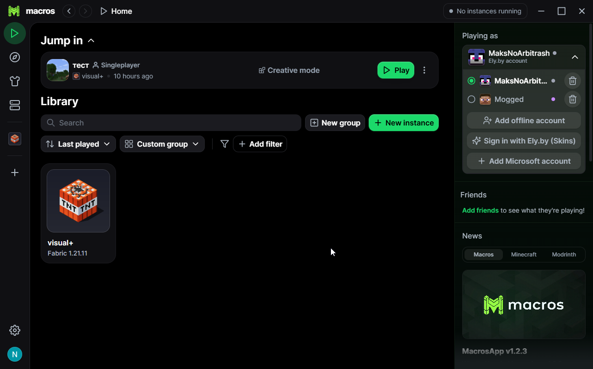
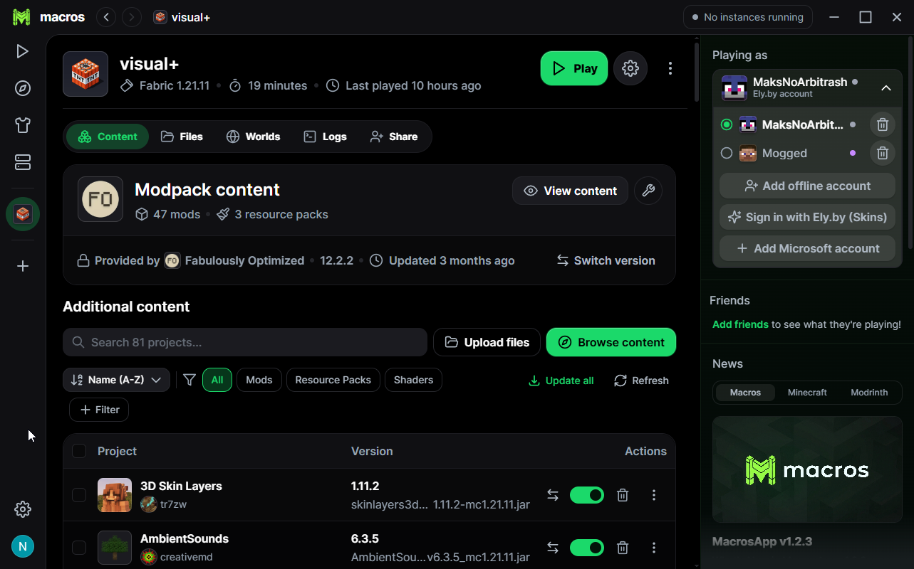
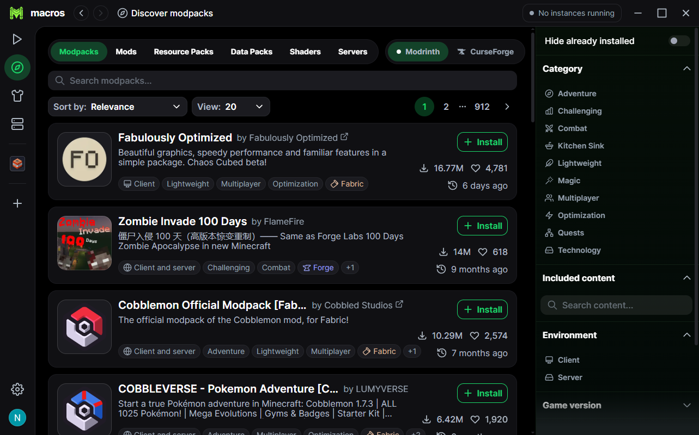
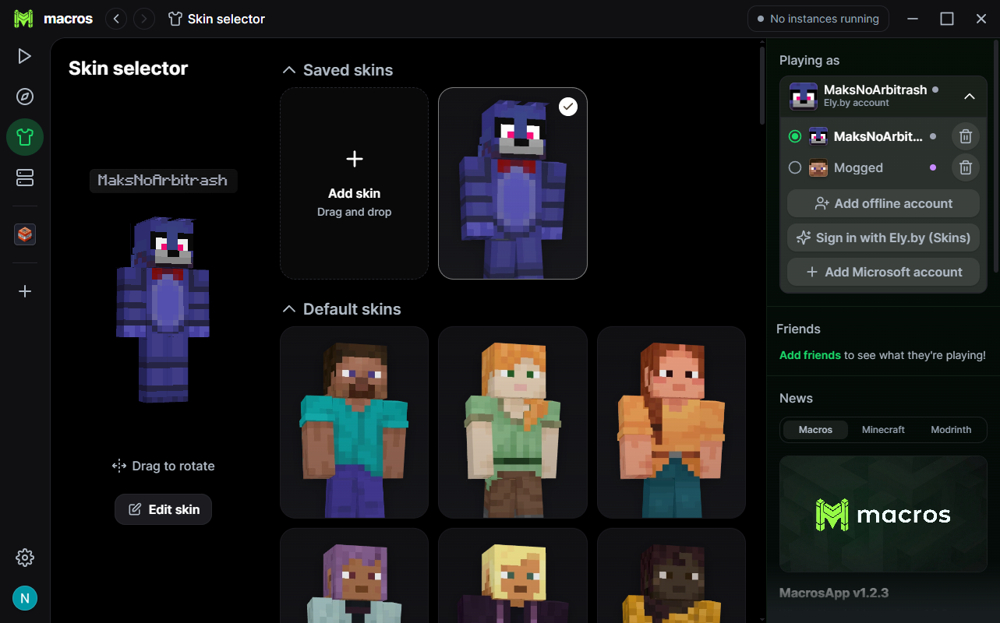

# MacrosApp 🎮

[](https://github.com/nnnegrvpeni-lang/MacrosApp/releases)
[](COPYING.md)
[](https://github.com/nnnegrvpeni-lang/MacrosApp/releases)

**MacrosApp** is a fast, lightweight, and modern Minecraft launcher featuring its own native **MacrosApp account system** and web portal ([macrosapp.duckdns.org](https://macrosapp.duckdns.org)), **Ely.by** skins and accounts support, **Offline mode (No-Auth)**, unified **CurseForge & Modrinth** catalog browsing, **real-time friend modpack sharing**, **Discord Rich Presence**, and a completely **ad-free** experience.

---

## 🌟 Key Features

### 🌐 Native MacrosApp Accounts & Web Platform
- **Full Account Migration**: Complete transition to the standalone MacrosApp account and backend ecosystem.
- **Web Portal ([macrosapp.duckdns.org](https://macrosapp.duckdns.org))**: Manage your account profile, custom avatars, bios, and shared modpacks directly from the web.
- **Instant Launcher Sync**: Log in seamlessly inside the launcher or via the web portal with session persistence.

### 👥 Friends & Private Modpack Sharing
- **Live Friends Sidebar**: See your friends' online status and active instances in real time via high-performance WebSockets.
- **Private & Secure Sharing**: Your shared modpacks are private by design — only accepted friends who are explicitly invited can view and install your packs.
- **Direct In-Launcher Invites**: Send one-click modpack invitations to friends with real-time popup toast notifications and instant installation.
- **Web Share Pages**: Convenient `/share/:invite_id` web previews with full mod lists and direct launcher deep-links.

### 🔔 Smart Update Notifications
- Non-intrusive update checks powered directly by GitHub Releases API.
- Graceful startup toast notifications with 10-second auto-dismiss.
- Compact update badge in the top bar and dedicated update management in Settings.

### 🔑 Seamless Modrinth Authentication
- Built-in OAuth window with automatic session capture.
- Instant single-click sign-in without external browser redirects or manual token copying.

### 🦊 Native Ely.by Integration
- **Secure OAuth2 Login**: Sign in via the official Ely.by website with a confirmation code — zero password exposure inside the launcher.
- **In-Game Skins & Capes**: Full skin and cape rendering powered by the official `by.ely:authlib` library.
- **Launcher Preview**: 2D/3D skin and cape rendering in the profile switcher and sidebar.

### 🎮 Offline Accounts (No-Auth)
- Launch Minecraft under any custom nickname without requiring a Microsoft account.
- Compliant Java offline UUID generation (`MD5("OfflinePlayer:" + username)`).
- Quick account switching between Microsoft, Ely.by, and Offline accounts.

### 📦 Unified Catalog: Modrinth + CurseForge
- Direct **Modrinth / CurseForge** source switch in the browse view.
- Search, filter versions, and install mods, modpacks, resource packs, and shaders directly into your instances from both ecosystems.

### 💬 Discord Rich Presence
- Real-time Discord status showcasing the active instance, Minecraft version, and play time.

### 📰 Multi-Feed News
- Stay up to date with multi-tab news feeds (Macros, Minecraft, and Modrinth articles) with a customizable visibility toggle in Settings.

### 🚫 100% Ad-Free
- No video ad players.
- Removed Modrinth+ upsells and sponsored banners.
- Clean, focused, and distraction-free UI.

---

## 📸 Screenshots

| 🖥️ Main Screen | 📦 Modpack & Instance Files |
| :---: | :---: |
|  |  |
| **🔍 CurseForge & Modrinth Browser** | **👕 3D Skin & Cape Customization** |
|  |  |

---

## 📥 Download

Prebuilt binaries for Windows:

👉 **[Download Latest MacrosApp Release](https://github.com/nnnegrvpeni-lang/MacrosApp/releases/latest)**

- **`Macros_1.2.7_x64-setup.exe`** — Official Windows installer (NSIS).
- **`Macros.exe`** — Portable standalone executable (no installation required).

---

## 🛠️ Building from Source

### Prerequisites
- **Node.js** (v20+)
- **pnpm** (`npm install -g pnpm`)
- **Rust** (stable toolchain)

### Build Steps
```bash
# 1. Clone the repository
git clone https://github.com/nnnegrvpeni-lang/MacrosApp.git
cd MacrosApp

# 2. Install dependencies
pnpm install

# 3. Build the application and installer
pnpm --filter @macros/app build
```

The output executables and installer will be located in:
- `target/release/bundle/nsis/Macros_1.2.7_x64-setup.exe` — Windows installer
- `target/release/Macros.exe` — Standalone binary

---

## 📜 License

MacrosApp is open-source software licensed under the **GNU General Public License v3.0 (GPLv3)**. See [COPYING.md](COPYING.md) for full license details.
